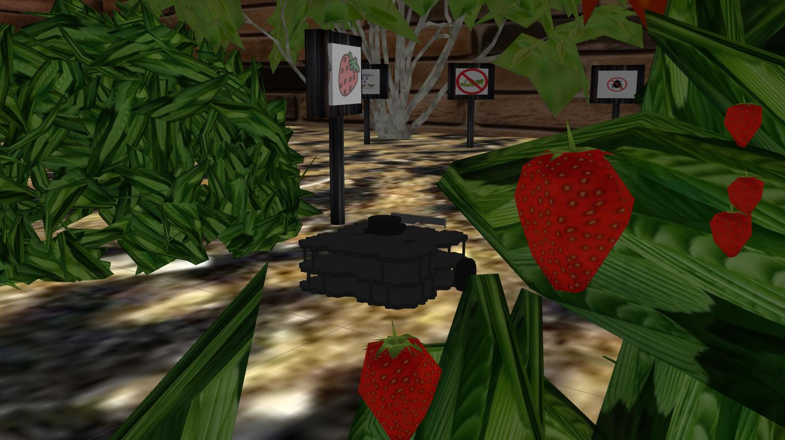

# Strawberry-field

# **About this work**  

This work is an example of *software-in-the-loop* (SIL), where trajectory planning is performed within a strawberry field using a visual memory. The process starts with a camera that compares a reference image with a desired image (the latter are stored in the visual memory). 

First, ORB points are detected in both images, and then a point correspondence is established to gather information and compute the homography matrix. This matrix provides data on rotation and translation. Finally, this information is used to integrate it into the IBVS control, as presented in [1].

<p align="center">
  
</p>

---

# **How to Run the Program**  

## **Prerequisites**  

You need to install OpenCV first. You can install it with the following command:

```bash
sudo apt-get update
sudo apt-get install libopencv-dev
```

You need to install the TurtleBot3 packages in order to use the TurtleBot in Gazebo:

- [TurtleBot3 Quick Start Guide](https://emanual.robotis.com/docs/en/platform/turtlebot3/quick-start/)
- [TurtleBot3 Simulation Setup](https://emanual.robotis.com/docs/en/platform/turtlebot3/simulation/)

You also need to install the ViSP library:

- [ViSP Installation Guide for Ubuntu](https://visp-doc.inria.fr/doxygen/visp-daily/tutorial-install-ubuntu.html)

Additionally, install the ViSP ROS package:

- [ViSP ROS GitHub Repository](https://github.com/lagadic/visp_ros)

## **Setup** 


This program was developed and tested in **ROS 1 Noetic**. 🚀

<p align="center">
  
</p>

---

## Contributors  

---


## References

[1] [https://inria.hal.science/inria-00350283v1/document](https://inria.hal.science/inria-00350283v1/document)

